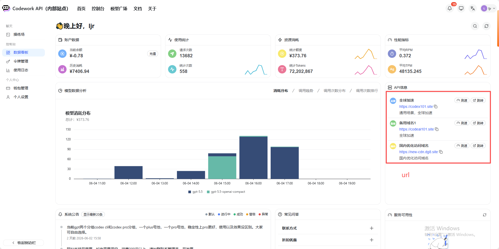
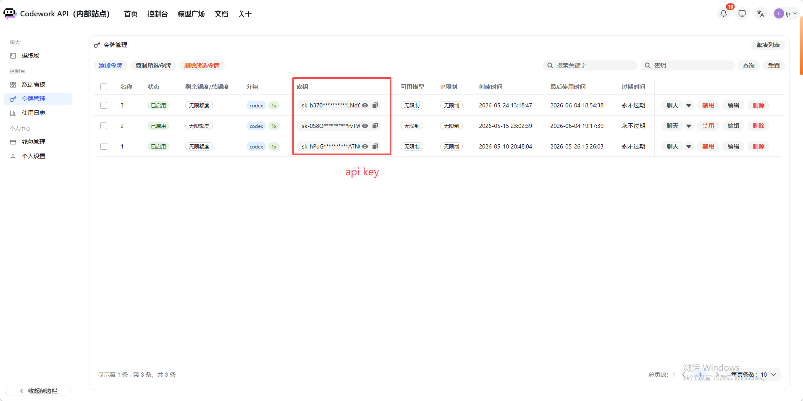
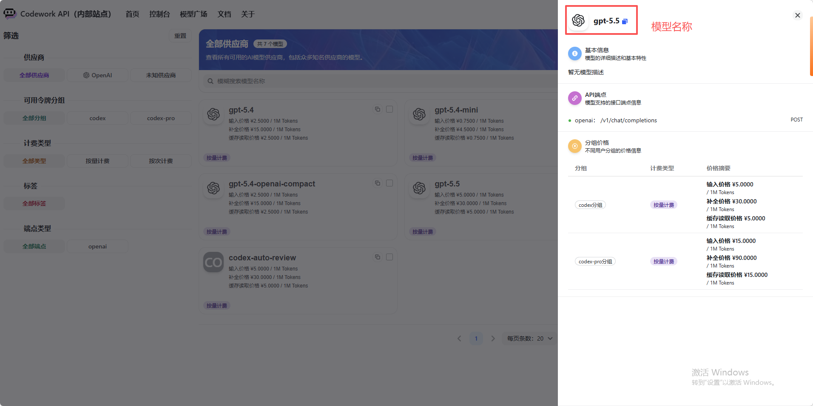
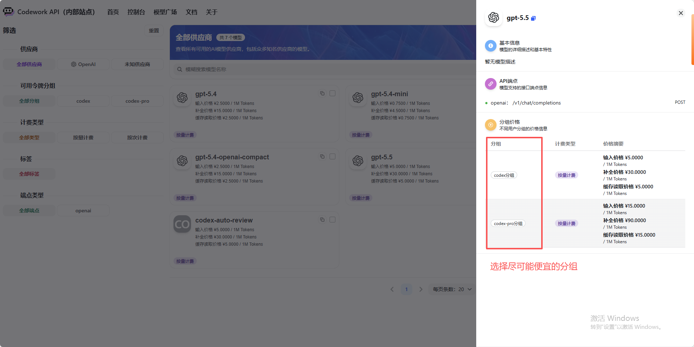
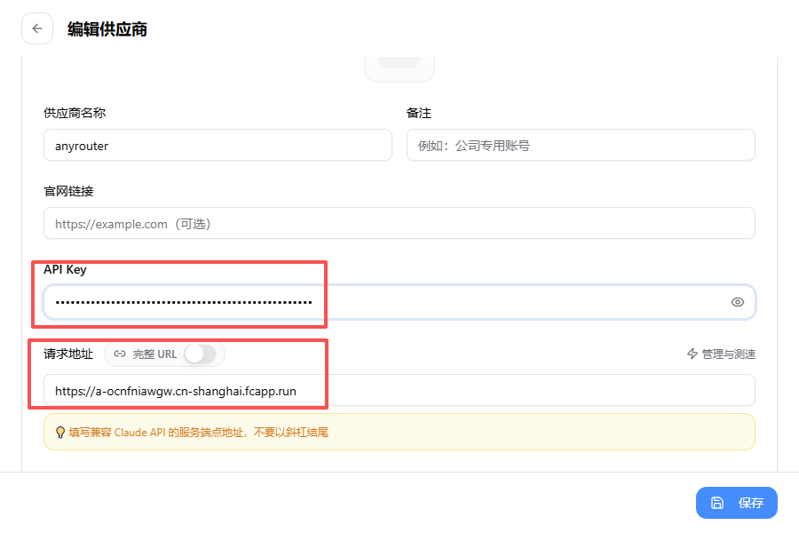
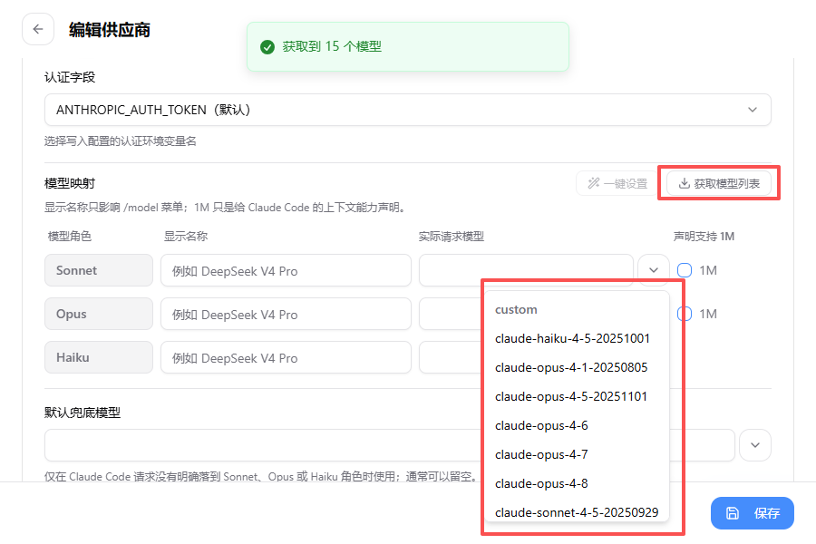
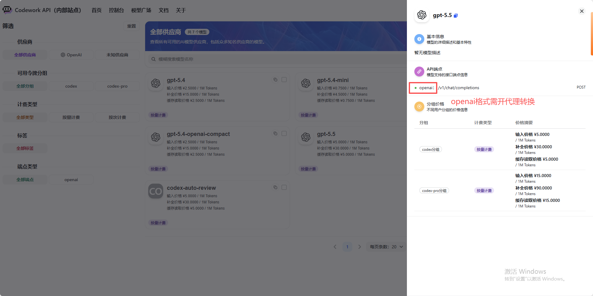
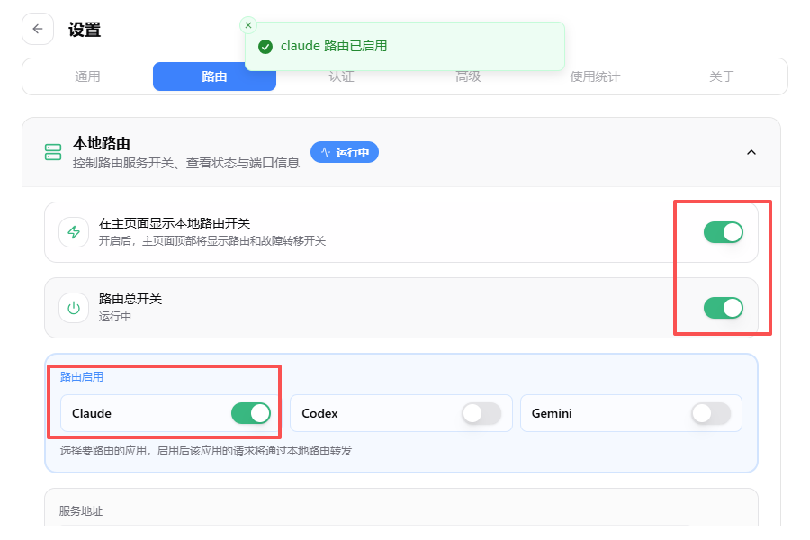
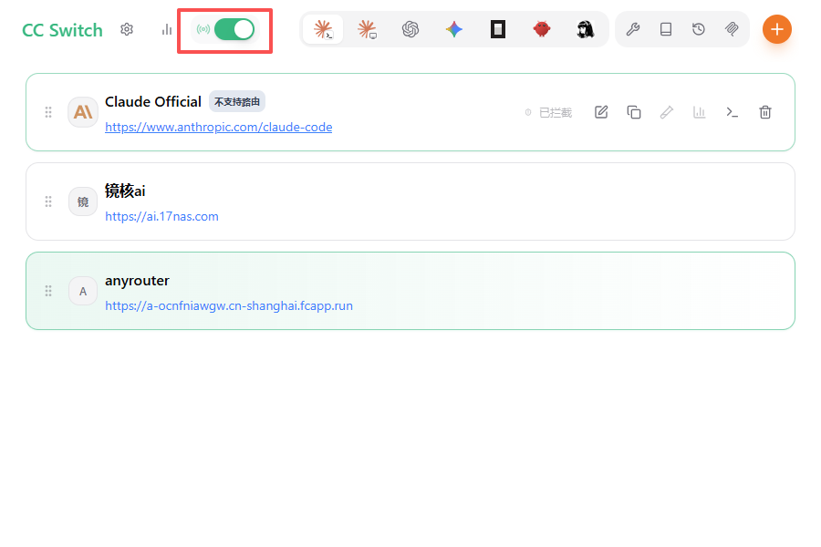

# Claude Code 小白完整使用指南

> 面向没有任何基础的用户。从"我需要一个 API key"到"我能高效用 Claude Code 干活"，全程手把手。

---

## 目录

1. [第一步：获取 API 中转站账号和 Key](#1-第一步获取-api-中转站账号和-key)
2. [第二步：在 CC Switch 里配置供应商](#2-第二步在-cc-switch-里配置供应商)
3. [第三步：验证 Claude Code 已接通](#3-第三步验证-claude-code-已接通)
4. [Claude Code 常用指令速查](#4-claude-code-常用指令速查)
5. [推荐工作流：高智讨论 + 低智落地](#5-推荐工作流高智讨论--低智落地)

---

## 1. 第一步：获取 API 中转站账号和 Key

### 为什么用中转站

直接用 Anthropic 官网需要境外支付方式。中转站帮你解决支付和网络问题，同时往往提供比官方更低的价格，并且支持 GPT、DeepSeek 等多家模型。

### 哪里找便宜的中转站

**→ [全网低价 API 中转站价格汇总表（实时更新）](https://docs.qq.com/sheet/DWFhhV3pMVnJGZXpO?tab=000001)**

这张表持续维护，列出了各中转站对 Claude / GPT / DeepSeek 的实际价格，直接按价格排序选。

### 公益站（每天免费 $25）

注册即可每天获得 $25 Claude Opus 4.8 免费额度，够大量使用：

**→ [anyrouter 注册链接](https://anyrouter.top/register?aff=rQEI)**

### 注册后需要取三样东西

登录中转站控制台，找到以下三项（以 Codework 为例，其他中转站界面类似）：

**① URL（接口地址）**

控制台首页右侧 "API 信息" 区域，有多个域名可选：



| 域名类型 | 适用场景 |
|---------|---------|
| 全球加速（如 `https://codex101.site`） | 通用，推荐首选 |
| 备用域名（如 `https://codeai101.site`） | 主域名挂了时用 |
| 国内优化（如 `https://new-cdn.dg8.site`） | 国内网络更稳定 |

任选一个复制，**不要加尾部斜杠 `/`**。

**② API Key**

左侧菜单 → 令牌管理，复制密钥（格式：`sk-xxxxxxxx`）。



**③ 模型名称**

左侧菜单 → 模型广场，找到你要用的模型，点击它查看详情，**复制右上角的模型 ID**（如 `gpt-5.5`、`claude-opus-4-8`）。



> **⚠️ 注意分组价格**：同一个模型可能有多个分组（如 `codex` 和 `codex-pro`），价格可能差几倍。查看"分组价格"，选价格最低的分组对应的令牌。



---

## 2. 第二步：在 CC Switch 里配置供应商

CC Switch 是随安装器一起装好的 GUI 工具，负责管理你的所有 API 供应商和模型配置。**Claude Code 本身不保存 key，全部通过 CC Switch 读取。**

### 2.1 打开 CC Switch

在桌面或开始菜单找到 **CC Switch** 图标，双击打开。

### 2.2 添加供应商

点击右上角的 **`+`** 按钮 → 填写以下信息：

| 字段 | 填什么 |
|------|-------|
| 供应商名称 | 随便填，方便自己认，如 `anyrouter` |
| API Key | 从令牌管理页复制的 `sk-xxxxxx` |
| 请求地址 | 从控制台复制的 URL，**末尾不带 `/`** |



> **⚠️ 请求地址不要以斜杠结尾**（CC Switch 界面有黄色提示）。

填完点 **保存**。

### 2.3 获取模型列表并配置映射

进入刚创建的供应商 → 编辑：

1. 点击 **"获取模型列表"** 按钮，CC Switch 会自动从你的中转站拉取所有可用模型名。
2. 在 **模型映射** 里，为 Sonnet / Opus / Haiku 三个角色分别选一个模型：



| 角色 | 推荐用途 | 示例模型 |
|------|---------|---------|
| Opus | Claude Code 主力（最聪明，慢而贵） | `claude-opus-4-8` |
| Sonnet | 日常任务（速度/价格均衡） | `claude-sonnet-4-5` |
| Haiku | 后台轻量任务（最快最便宜） | `claude-haiku-4-5` |

3. 勾选 **声明支持 1M**（Claude Code 需要此声明才能使用长上下文）。
4. 点 **保存**。

### 2.4 OpenAI 格式的中转站需要开启代理

**判断方法**：在模型广场里，如果某个模型的 API 端点显示的是 `openai: /v1/chat/completions`（而非 `anthropic: /v1/messages`），说明该模型走的是 OpenAI 格式，**需要开启 CC Switch 代理转换**，否则 Claude Code 无法识别。



**操作步骤**：

1. CC Switch 主界面 → 顶部点 ⚙️ 齿轮（设置）→ 切换到 **路由** 选项卡
2. 打开 **"路由总开关"**（右侧绿色 toggle）
3. 在 **"路由启用"** 里，打开 **Claude** 对应的 toggle



4. 返回主界面，确认顶部中间的**代理图标**（天线图标）已变绿



> **纯 Anthropic 格式的中转站不需要这一步**（如 anyrouter 等原生 Claude API 中转），填好 Key + URL 直接用即可。

### 2.5 启用供应商

在 CC Switch 主界面，找到刚添加的供应商，点击 **Enable（启用）**，供应商行背景变成浅绿色即为当前激活状态。

---

## 3. 第三步：验证 Claude Code 已接通

打开终端（或 VS Code 内终端），输入：

```bash
claude
```

正常的话会出现 Claude Code 交互界面。输入 `/model` 查看当前用的是哪个模型。

如果报错 `auth error` 或 `connection refused`，检查：
- CC Switch 的供应商是否已 Enable（绿色背景）
- 如果是 OpenAI 格式模型，路由开关是否打开
- URL 末尾没有多余的 `/`

---

## 4. Claude Code 常用指令速查

### 4.1 模型切换

```bash
/model                    # 查看当前模型 + 可选模型列表
/model opus               # 切换到 Opus（最强，用于复杂任务）
/model sonnet             # 切换到 Sonnet（均衡，日常主力）
/model haiku              # 切换到 Haiku（最快最省钱）
```

也可以直接指定模型完整名称：

```bash
/model claude-opus-4-8
/model gpt-5.5
```

### 4.2 思考深度

在提问时加关键词控制 Claude 思考的深度（消耗更多 token，但解决更难的问题）：

```
think                     # 轻度思考
think hard                # 中度思考
think harder              # 深度思考
ultrathink                # 最深度思考（用于最复杂的问题，显著增加成本）
```

示例：
```
think hard 帮我设计一套用户权限系统，需要考虑 RBAC 和多租户
```

### 4.3 @ 引用文件 / 目录

```
@path/to/file.ts          # 引用单个文件的内容
@src/                     # 引用整个目录
@PLAN.md                  # 引用计划文档（核心工作流，见下文）
```

示例：
```
@src/auth/ 这段登录逻辑有没有安全问题？
```

### 4.4 其他实用指令

```bash
/plan                     # 进入计划模式（只规划，不改文件）
/review                   # 代码审查
/debug                    # 系统性调试
/doctor                   # 检查 Claude Code 配置是否正常
/mcp-status               # 查看 MCP 服务器状态
/clear                    # 清空当前对话上下文
```

---

## 5. 推荐工作流：高智讨论 + 低智落地

这是让 Claude Code 效果最好、成本最低的核心工作方式。

### 核心思路

```
高智模型（贵）负责"想清楚"  →  低智模型（便宜）负责"按图纸干活"
```

价格差异可能是 10-50 倍，但对于执行已有计划这种任务，低智模型完全够用。

### 具体步骤

**第一阶段：讨论 + 出计划**

1. 打开 Claude Code，切换到**最强模型**（`/model opus` 或 GPT-5.5 等）
2. 用**多轮对话**方式，和它充分讨论你的需求：
   - 描述问题背景、约束条件、期望结果
   - 主动追问："还有哪些边界情况我没想到？"
   - 请它输出一份**完整详细的计划文档**，保存到文件（如 `PLAN.md`）

3. **遇到特别困难的问题**，可以开两个窗口：
   - 一个接 GPT（如 gpt-5.5），一个接 Claude Opus
   - 让其中一个写方案，另一个审查，轮流迭代
   - 两个顶级模型互相 review，发现的问题会比单独用一个多很多

**第二阶段：按计划落地**

1. **新开一个 Claude Code 窗口**（关键：新窗口 = 干净上下文）
2. 切换到**低智模型**省钱（`/model haiku` 或 DeepSeek V3 Flash 等）
3. 用 `@` 引用计划文档，发出指令：

```
@PLAN.md 请严格按照这份计划文档的步骤落地实现，不要偏离计划，遇到不确定的地方先停下来问我
```

4. 如果执行中遇到复杂子问题，再临时切回高智模型处理，处理完继续用低智模型

### 为什么这样做

- **计划文档充当"图纸"**：低智模型按图纸干活效果比让它自己想要好得多
- **新窗口避免上下文污染**：讨论阶段产生的大量 token 不会浪费在执行阶段
- **成本大幅降低**：思考阶段花少量钱，执行阶段用便宜模型，综合成本可降低 80%+
- **双模型互审**：对于特别重要或复杂的问题，两个模型互相挑错远比一个模型自检可靠

---

## 快速参考卡

| 我想做什么 | 操作 |
|-----------|------|
| 查当前用哪个模型 | `/model` |
| 换成最强模型 | `/model opus` |
| 换成省钱模型 | `/model haiku` |
| 让它深度思考 | 问题前加 `think hard` |
| 引用项目文件 | `@文件路径` |
| 按计划文档干活 | `@PLAN.md 按计划落地` |
| 检查配置正常 | `/doctor` |
| 清空对话重来 | `/clear` |
| 找便宜中转站 | [价格表](https://docs.qq.com/sheet/DWFhhV3pMVnJGZXpO?tab=000001) |
| 免费额度（$25/天） | [anyrouter](https://anyrouter.top/register?aff=rQEI) |
